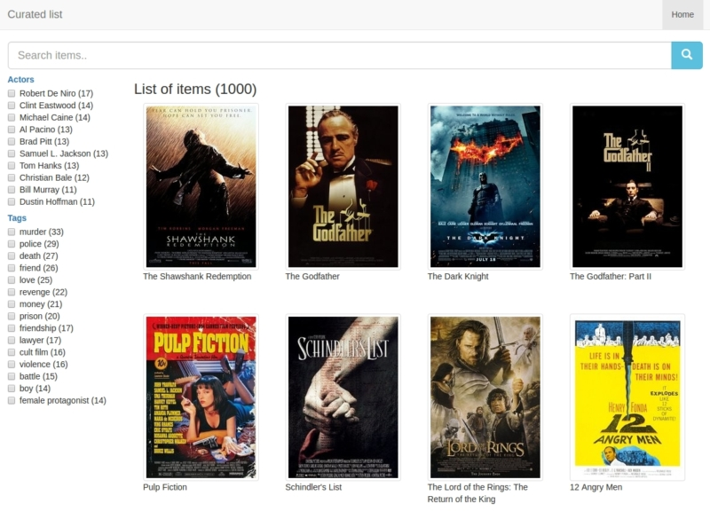

# Curated list

Building nice curated list by editing yaml file

## Features

- faceted & full search
- no db dependencies (search engine written in js)
- website powered by editing simple yaml file
- simple template engine (similar to twig)

## Getting started

```bash
git clone git@github.com:itemsapi/curated-list.git
npm install
```

Edit `config.yaml`:

```yaml
search:
  aggregations:
    tags: 
      size: 15
      title: Tags
    actors: 
      size: 10
      title: Actors
data:
  type: url
  url: https://storage.googleapis.com/imdb-list/imdb.json
```

```bash
npm start
```

Result:



[See another examples](examples.md)

## Deployment

```bash
# install now
npm install now -g
# deploy app with now 
now
```

## Technologies

- [Express](https://github.com/expressjs/express) (minimalist web framework for Node.js)
- [ItemsJS](https://github.com/itemsapi/itemsjs) (full text, faceted search engine in javascript)

## Contributions

Any help from talented people with design or programming skills is very welcome.
