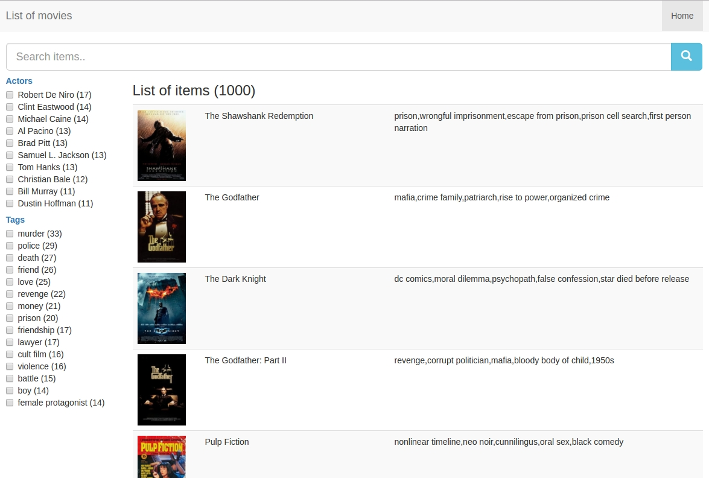
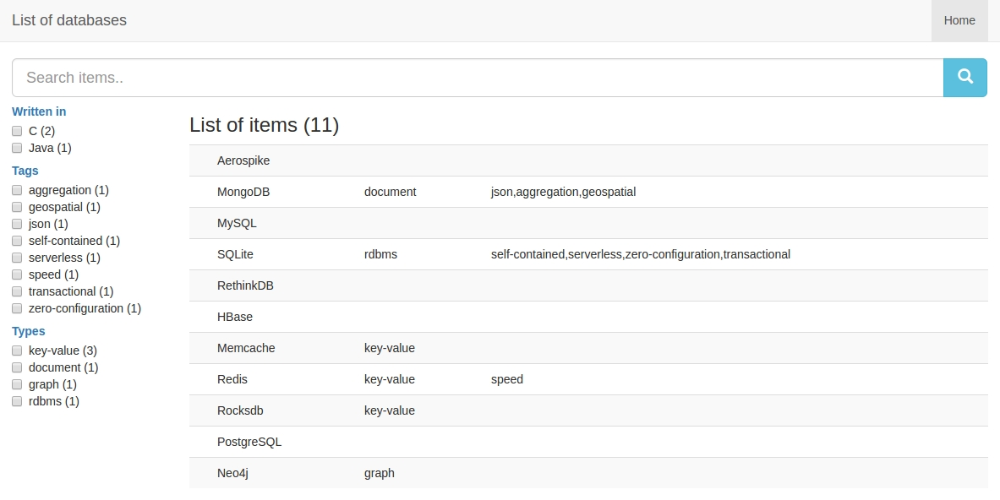

# Examples

```bash
git clone git@github.com:itemsapi/curated-list.git
npm install
```

## Movies

Edit `config.yaml`:

```yaml
website:
  title: List of movies
  layout: 
    name: table
    columns: 
      - image
      - name
      - tags
search:
  aggregations:
    tags: 
      size: 15
      title: Tags
    actors: 
      size: 10
      title: Actors
data:
  type: url
  url: https://storage.googleapis.com/imdb-list/imdb.json
```

```bash
npm start
```

Result:




## Databases

Edit `config.yaml`:

```yaml
website:
  title: List of databases
  layout: 
    name: table
    columns: 
      - name
      - type
      - tags
search:
  aggregations:
    type: 
      size: 15
      title: Types
    tags: 
      size: 15
      title: Tags
    written: 
      size: 15
      title: Written in
data:
  values:
    - name: Aerospike
    - name: MongoDB
      tags:
        - json
        - aggregation
        - geospatial
      type: document
    - name: MySQL
    - name: SQLite
      type: rdbms
      tags:
        - self-contained
        - serverless
        - zero-configuration
        - transactional
```

```bash
npm start
```

Result:


